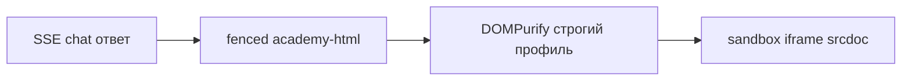

# Rich AI output: HTML-отчёты в чате (итерация под пример пользователя)

## Цель продукта (уточнение)

Пользователь хочет генерировать в процессе диалога **полноценные HTML-отчёты** в духе файла вроде `Lead_Time_полный_отчет … .html`: сводная страница с секциями, таблицами, типографикой и «отчётным» оформлением — не только markdown в пузыре чата.

Файл по пути на локальном ПК (`c:\Users\…`) в среду агента **не попадает**; для точного совпадения со стилем разумно один раз **вставить в чат фрагмент** (шапка + один блок + таблица) или положить образец в репозиторий как reference.

## Архитектура (без смены базового подхода)

Протокол fenced-блоков из исходного плана сохраняется; для отчётов основной носитель — блок ` ```academy-html` … ``` ` с **одним самодостаточным HTML-документом** (DOCTYPE, `<meta charset>`, `<style>` внутри страницы).



## Совместимость с «настоящими» отчётами

| Особенность примера | В MVP |
|---------------------|--------|
| Таблицы, сетки, заголовки, KPI-карточки | Да — обычный HTML + CSS |
| Печать / «как страница» | Да — `@media print`, ширина контейнера |
| Диаграммы через JS (Chart.js и т.д.) | Осторожно: **sandbox без скриптов** по умолчанию не выполнит JS. Варианты: (a) модель генерирует **SVG/CSS/Mermaid** вместо canvas-графиков; (b) позже — отдельный режим только для админов или экспорт «скачать .html» и открыть локально с полными возможностями |
| Внешние CDN скриптов в отчёте | Не рекомендуется в чате из соображений CSP и XSS; лучше inline SVG и локальный CSS |

Итог: для большинства корпоративных отчётов достаточно **статичного HTML+CSS**; если ваш образец тяжело завязан на JS-графики — зафиксируем это при реализации и выберем один из вариантов выше.

## Изменения по файлам (при исполнении плана)

- [`prompts/mentorPrompt.js`](/workspace/prompts/mentorPrompt.js) — явно потребовать для «полного отчёта» структуру документа (title, секции, таблицы, print-friendly CSS); при необходимости ссылаться на пользовательский образец, если он добавлен в сообщение.
- [`public/js/academy-app.js`](/workspace/public/js/academy-app.js) — парсер `academy-html`, iframe sandbox, санитизация.
- [`server.js`](/workspace/server.js) — при необходимости CSP для CDN (например Mermaid), не ослабляя общую политику для произвольного HTML модели.

## Проверка приёмки

- Запрос в чате: «Сделай отчёт по метрикам lead time в формате одной HTML-страницы как приложение к отчёту» → в ответе видим превью отчёта в iframe.
- Тот же контент при перезагрузке страницы подтягивается из истории без потери разметки.

## Todo (при исполнении)

- mentor-prompt-protocol: расширить промпт под полноценные HTML-отчёты + версия.
- client-parse-render: парсер + iframe + санитизация.
- csp-cdn: точечно под Mermaid/CDN при необходимости.
- image-spec-wire: опционально для инфографики через существующий image endpoint.
